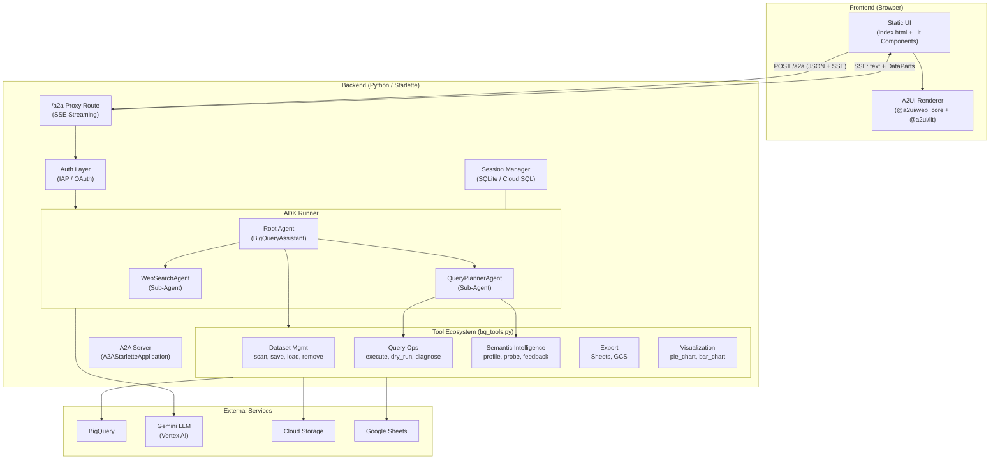
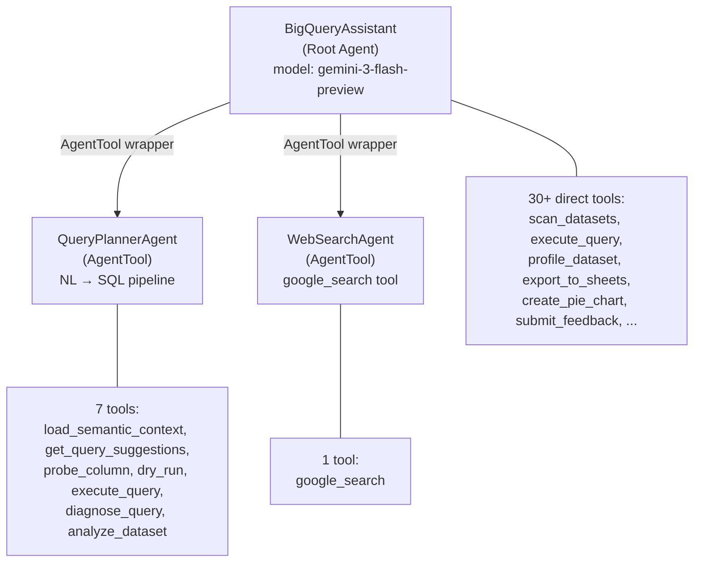
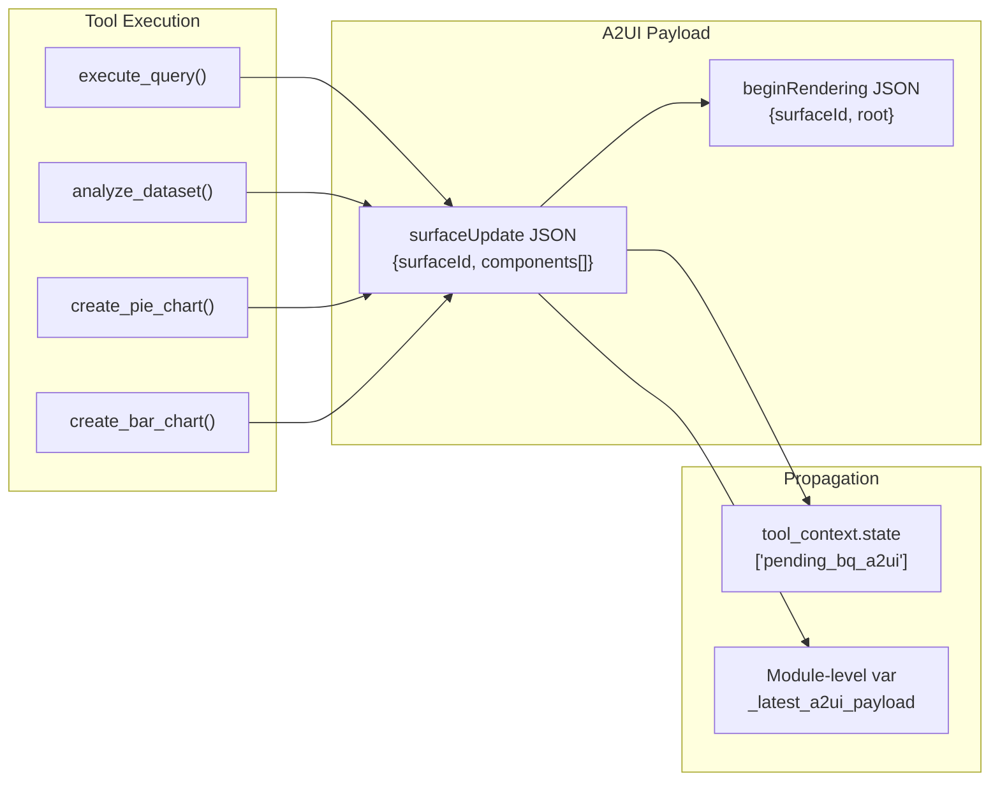
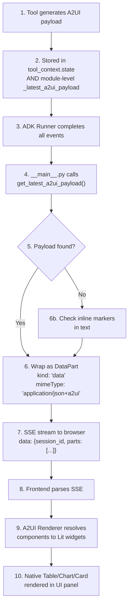
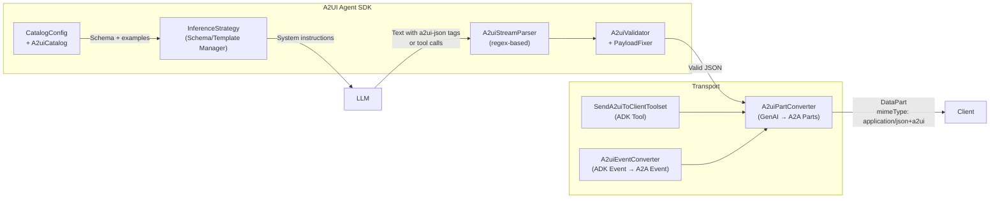

# Data Assistant — Architecture & Design Flow

## 1. High-Level Architecture



---

## 2. Agent Architecture

### 2.1 Agent Hierarchy



**Key design decisions:**

| Aspect | Implementation |
|---|---|
| **Framework** | Google ADK (`google.adk.agents`) |
| **Model** | `gemini-3-flash-preview` (Vertex AI) |
| **Sub-agent pattern** | `AgentTool` wrappers — output returns to root (no control transfer) |
| **Session persistence** | `DatabaseSessionService` (SQLite local / Cloud SQL production) |
| **Callback** | `widget_callback` (after_model_callback) — currently a no-op; A2UI extraction happens in `__main__.py` |

### 2.2 Root Agent Responsibilities

The root agent ([agent.py](file:///home/user/dataassistant-main/dataagent/agents/bq_assistant/agent.py)) orchestrates:

1. **Greeting & workspace loading** — mandatory first message + `load_selected_datasets`
2. **Dataset management** — scan, save, remove, set default
3. **Query delegation** — routes NL questions to `QueryPlannerAgent`
4. **Direct query execution** — for saved queries, user-provided SQL, simple checks
5. **Profiling** — background profiling via `start_background_profile`
6. **Feedback loop** — `submit_feedback` for continuous learning
7. **Export & visualization** — Sheets, GCS, pie/bar charts

### 2.3 QueryPlannerAgent Pipeline

The sub-agent follows a strict 5-step pipeline with self-correction:

```
Step 1: load_semantic_context     → Load knowledge graph
Step 2: get_query_suggestions     → Find similar past queries
Step 3: probe_column (if needed)  → Inspect ambiguous values
Step 4: dry_run (recommended)     → Validate SQL syntax + cost
Step 5: execute_query             → Run and learn from success
        ↳ Self-correct on 0 rows or errors (max 2 retries)
```

---

## 3. A2A Protocol Usage

### 3.1 What is A2A here?

A2A (Agent-to-Agent / Agent-to-App) is the **transport protocol** used to communicate between the backend agent and the frontend. The project uses the [a2a-python SDK](file:///home/user/dataassistant-main/dataagent/agents/bq_assistant/__main__.py#L14) (`a2a.server.apps.A2AStarletteApplication`).

### 3.2 Server Setup

In [\_\_main\_\_.py](file:///home/user/dataassistant-main/dataagent/agents/bq_assistant/__main__.py#L905-L979):

```python
# 1. Define the AgentCard (identity + capabilities)
agent_card = AgentCard(
    name="BigQueryAssistant",
    capabilities=AgentCapabilities(streaming=True),
    ...
)

# 2. Create ADK Runner with session persistence
_runner = Runner(
    agent=root_agent,
    session_service=DatabaseSessionService(db_url="sqlite+aiosqlite:///sessions.db"),
    ...
)

# 3. Wire executor + A2A server
executor = SimpleBqExecutor(runner=_runner)
server = A2AStarletteApplication(agent_card=agent_card, http_handler=handler)
app = server.build()

# 4. Add custom routes ON TOP of the A2A standard routes
app.routes.insert(0, Route("/a2a", a2a_proxy_handler, methods=["POST"]))
app.routes.insert(0, Route("/sessions", ...))
app.routes.insert(0, Route("/auth/user", ...))
```

### 3.3 The `/a2a` Proxy — SSE Streaming

The custom `/a2a` proxy handler ([line 686](file:///home/user/dataassistant-main/dataagent/agents/bq_assistant/__main__.py#L686)) replaces the standard A2A request handler for direct frontend communication:

```mermaid
sequenceDiagram
    participant Browser
    participant /a2a as /a2a Proxy
    participant Auth
    participant Runner as ADK Runner
    participant Tools as bq_tools
    participant BQ as BigQuery

    Browser->>+/a2a: POST {request: "show top stations", session_id: "abc"}
    /a2a->>Auth: Verify (IAP headers or OAuth token)
    Auth-->>+/a2a: email: user@company.com
    
    /a2a->>Runner: run_async(user_id, session_id, message)
    
    loop ADK Event Stream
        Runner->>Tools: function_call (e.g. execute_query)
        /a2a-->>Browser: SSE: {"kind":"text","text":"🚀 Executing query..."}
        Tools->>BQ: SQL query
        BQ-->>Tools: Result rows
        Tools->>Tools: Build A2UI payload + store in _latest_a2ui_payload
        Tools-->>Runner: Return text result
    end

    /a2a->>Tools: get_latest_a2ui_payload()
    /a2a-->>-Browser: SSE: {session_id, parts: [{kind:"text",...}, {kind:"data", data:{surfaceUpdate:...}, metadata:{mimeType:"application/json+a2ui"}}]}
```

### 3.4 A2A DataPart Structure

A2UI payloads are wrapped as A2A `DataPart` objects with the MIME type `application/json+a2ui`:

```json
{
  "kind": "data",
  "data": {
    "surfaceUpdate": {
      "surfaceId": "table_a1b2c3d4",
      "components": [
        {
          "id": "table_query_results_table_a1b2c3d4",
          "component": {
            "Table": {
              "tableTitle": {"literalString": "Top Stations (125 total rows)"},
              "headers": {"literalArray": [{"literalString": "station"}, {"literalString": "trips"}]},
              "rows": {"literalArray": [{"literalArray": [{"literalString": "Zilker Park"}, {"literalString": "10742"}]}]}
            }
          }
        }
      ]
    }
  },
  "metadata": {"mimeType": "application/json+a2ui"}
}
```

### 3.5 Two A2A Modes in this Project

| Mode | Where | Purpose |
|---|---|---|
| **Standard A2A** | `SimpleBqExecutor` ([line 242](file:///home/user/dataassistant-main/dataagent/agents/bq_assistant/__main__.py#L242)) | Formal A2A task lifecycle (for remote agent-to-agent calls) |
| **Custom /a2a Proxy** | `a2a_proxy_handler` ([line 686](file:///home/user/dataassistant-main/dataagent/agents/bq_assistant/__main__.py#L686)) | Direct SSE streaming to the browser (primary mode) |

---

## 4. A2UI — Agent-to-User Interface

### 4.1 What is A2UI?

A2UI is a **declarative JSON format** that allows agents to describe UI components without sending executable code. The agent sends a `surfaceUpdate` with a flat list of components; the frontend **renderer** maps them to native widgets.

> **Core philosophy:** *Safe like data, but expressive like code.*

### 4.2 A2UI Payload Generation (Backend)

Tools in [bq_tools.py](file:///home/user/dataassistant-main/dataagent/bq_tools.py) generate A2UI payloads directly:



**Example from `execute_query` ([line 527-562](file:///home/user/dataassistant-main/dataagent/bq_tools.py#L527-L562)):**

```python
# Build A2UI Table component from BigQuery results
flat_components = [{
    "id": table_component_id,
    "component": {
        "Table": {
            "tableTitle": {"literalString": f"{title} ({total_rows} total rows)"},
            "headers": {"literalArray": [{"literalString": h} for h in headers]},
            "rows": {"literalArray": [
                {"literalArray": [{"literalString": c} for c in row]}
                for row in rows_data
            ]}
        }
    }
}]

a2ui_payload = [
    {"beginRendering": {"surfaceId": unique_id, "root": table_component_id}},
    {"surfaceUpdate": {"surfaceId": unique_id, "components": flat_components}}
]

# Dual propagation (reliability pattern)
tool_context.state['pending_bq_a2ui'] = a2ui_payload   # ADK state
_latest_a2ui_payload = a2ui_payload                      # Module-level backup
```

### 4.3 A2UI Propagation: Tool → Frontend



> [!IMPORTANT]
> **Dual propagation pattern**: The payload is stored both in `tool_context.state['pending_bq_a2ui']` AND in a module-level variable `_latest_a2ui_payload`. This is because ADK session state doesn't reliably propagate from sub-agent (`QueryPlannerAgent`) tool contexts to the parent session. The module-level variable acts as a reliable bypass.

### 4.4 Frontend Rendering Pipeline

The frontend ([static_ui/index.html](file:///home/user/dataassistant-main/dataagent/agents/bq_assistant/static_ui/index.html)) is a pre-built Lit application:

```
index.html
  └─ <a2ui-contact>              ← Lit web component (entry point)
       └─ contact-C_F9dgE0.js   ← Bundled app (753KB)
            ├─ SSE client        → POST /a2a, parse SSE stream
            ├─ Message parser    → Separate text parts from data parts
            ├─ @a2ui/web_core    → State management (Preact signals)
            │    ├─ MessageProcessor  → Processes surfaceUpdate messages
            │    ├─ SurfaceModel      → Tracks component tree per surface
            │    └─ DataModel         → Reactive data binding
            └─ @a2ui/lit         → Component registry
                 ├─ Table        → Renders data grids
                 ├─ Card         → Container with title
                 ├─ Text         → Text display
                 ├─ Column/Row   → Layout containers
                 ├─ Button       → Interactive buttons
                 └─ PieChart/BarChart → Chart rendering
```

### 4.5 Component Resolution

The A2UI renderer uses a **catalog-based registry pattern**:

1. The `surfaceUpdate` arrives with abstract component types (e.g., `"Table"`, `"Card"`)
2. The `web_core` library validates the JSON against the A2UI schema
3. The Lit renderer maps each type to a concrete web component
4. Data binding uses `literalString`, `literalArray`, and JSON Pointer paths

```
Agent sends:                    Frontend renders:
─────────────                   ─────────────────
{"Table": {headers, rows}}  →  <a2ui-table> (interactive data grid)
{"Card": {title, child}}    →  <a2ui-card> (styled container)
{"Text": {text}}            →  <a2ui-text> (formatted text)
{"Column": {children}}      →  <a2ui-column> (vertical layout)
{"PieChart": {data, ...}}   →  <a2ui-pie-chart> (canvas chart)
```

### 4.6 Session History & Surface Reconstruction

When a user switches conversations, the frontend calls `GET /sessions/{id}` which returns both `messages` and `surfaces`:

```json
{
  "messages": [
    {"role": "user", "text": "show top stations"},
    {"role": "model", "text": "Here are the results..."}
  ],
  "surfaces": [
    {
      "after_message": 1,
      "a2ui": [{"surfaceUpdate": {...}}, {"beginRendering": {...}}]
    }
  ]
}
```

The surfaces are extracted from ADK event `state_delta` records ([line 615-624](file:///home/user/dataassistant-main/dataagent/agents/bq_assistant/__main__.py#L615-L624)), allowing full UI reconstruction without re-executing queries.

---

## 5. A2UI SDK Architecture (For Reference)

The project includes a multi-language Agent SDK ([agent_sdks/](file:///home/user/dataassistant-main/agent_sdks)) that provides the **formal** A2UI integration path:



> [!NOTE]
> The Data Assistant (`bq_assistant`) uses a **direct payload construction** approach in `bq_tools.py` rather than the SDK's LLM-generation + parsing pipeline. The tools build A2UI JSON programmatically from BigQuery results, which is more reliable for structured data than asking the LLM to generate UI JSON.

---

## 6. End-to-End Request Lifecycle

```
User types: "Show me the top 10 bike stations by trips"
    │
    ▼
[Browser] POST /a2a {request: "...", session_id: "abc-123"}
    │
    ▼
[Auth] Verify IAP header or OAuth token → email: user@company.com
    │
    ▼
[ADK Runner] Create/resume session for user_abc → Run root agent
    │
    ├─── SSE: "🧠 Planning and executing query..."
    │
    ▼
[Root Agent] Delegates to QueryPlannerAgent
    │
    ├── Step 1: load_semantic_context("bikeshare")
    │     └── SSE: "🔍 Loading semantic knowledge..."
    ├── Step 2: get_query_suggestions("top stations by trips")
    │     └── SSE: "📚 Finding similar past queries..."
    ├── Step 3: probe_column (skipped — no ambiguity)
    ├── Step 4: dry_run(sql) → validates OK
    │     └── SSE: "✅ Validating query syntax..."
    └── Step 5: execute_query(sql, question, dataset)
          │
          ├── BigQuery returns 10 rows
          ├── bq_tools builds A2UI Table payload
          ├── Stores in _latest_a2ui_payload
          ├── Records query in semantic catalog (learning)
          └── SSE: "🚀 Executing query..."
    │
    ▼
[/a2a proxy] Collects final text + A2UI payloads
    │
    ▼
[SSE Final] data: {
    session_id: "abc-123",
    parts: [
        {kind: "text", text: "Here are the top 10 stations..."},
        {kind: "data", data: {surfaceUpdate: {Table: ...}},
         metadata: {mimeType: "application/json+a2ui"}}
    ]
}
    │
    ▼
[Browser] Parses SSE → renders text in chat + A2UI Table in side panel
```

---

## 7. Key Files Reference

| Layer | File | Purpose |
|---|---|---|
| **Agent definition** | [agent.py](file:///home/user/dataassistant-main/dataagent/agents/bq_assistant/agent.py) | Root agent + sub-agents, instructions, tool wiring |
| **Server + A2A** | [\_\_main\_\_.py](file:///home/user/dataassistant-main/dataagent/agents/bq_assistant/__main__.py) | A2A server, /a2a proxy, auth, session endpoints |
| **Tools + A2UI gen** | [bq_tools.py](file:///home/user/dataassistant-main/dataagent/bq_tools.py) | 30+ BigQuery tools, A2UI payload construction |
| **Semantic layer** | [semantic_catalog.py](file:///home/user/dataassistant-main/dataagent/semantic_catalog.py) | Knowledge graph, query history, profiling |
| **Query intelligence** | [query_planner.py](file:///home/user/dataassistant-main/dataagent/query_planner.py) | Diagnostics, error analysis, empty-result diagnosis |
| **A2UI SDK (Python)** | [a2a.py](file:///home/user/dataassistant-main/agent_sdks/python/src/a2ui/a2a.py) | A2A Part creation, parsing, streaming utilities |
| **A2UI ADK Extension** | [send_a2ui_to_client_toolset.py](file:///home/user/dataassistant-main/agent_sdks/python/src/a2ui/adk/a2a_extension/send_a2ui_to_client_toolset.py) | Toolset, part converter, event converter |
| **Frontend** | [static_ui/index.html](file:///home/user/dataassistant-main/dataagent/agents/bq_assistant/static_ui/index.html) | Entry point + pre-built Lit bundle |
| **Web core renderer** | [renderers/web_core/](file:///home/user/dataassistant-main/renderers/web_core) | Framework-agnostic state management + protocol handling |
| **Lit renderer** | [renderers/lit/](file:///home/user/dataassistant-main/renderers/lit) | Lit web component implementations |
| **A2UI specification** | [specification/](file:///home/user/dataassistant-main/specification) | JSON Schema definitions (v0.8, v0.9, v0.10) |
