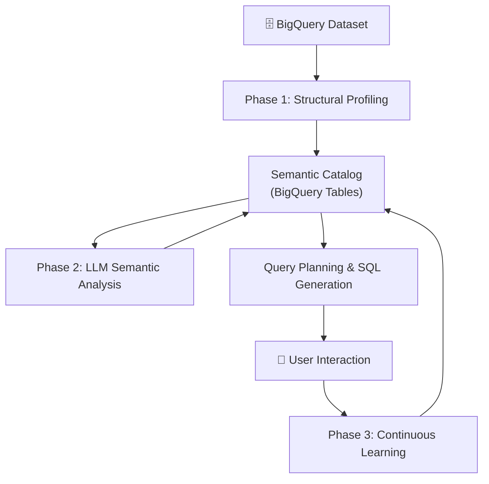
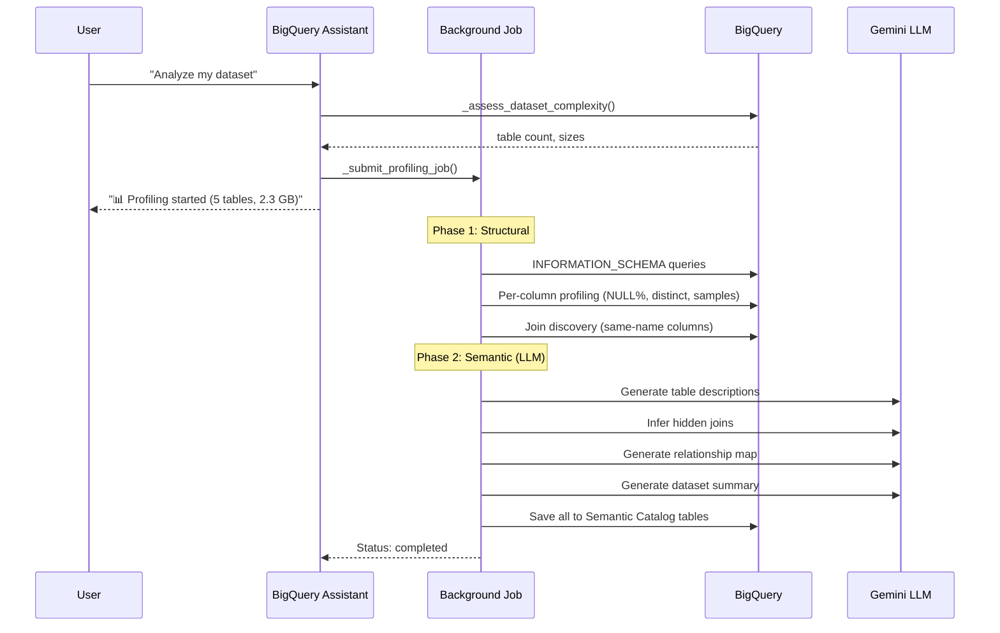
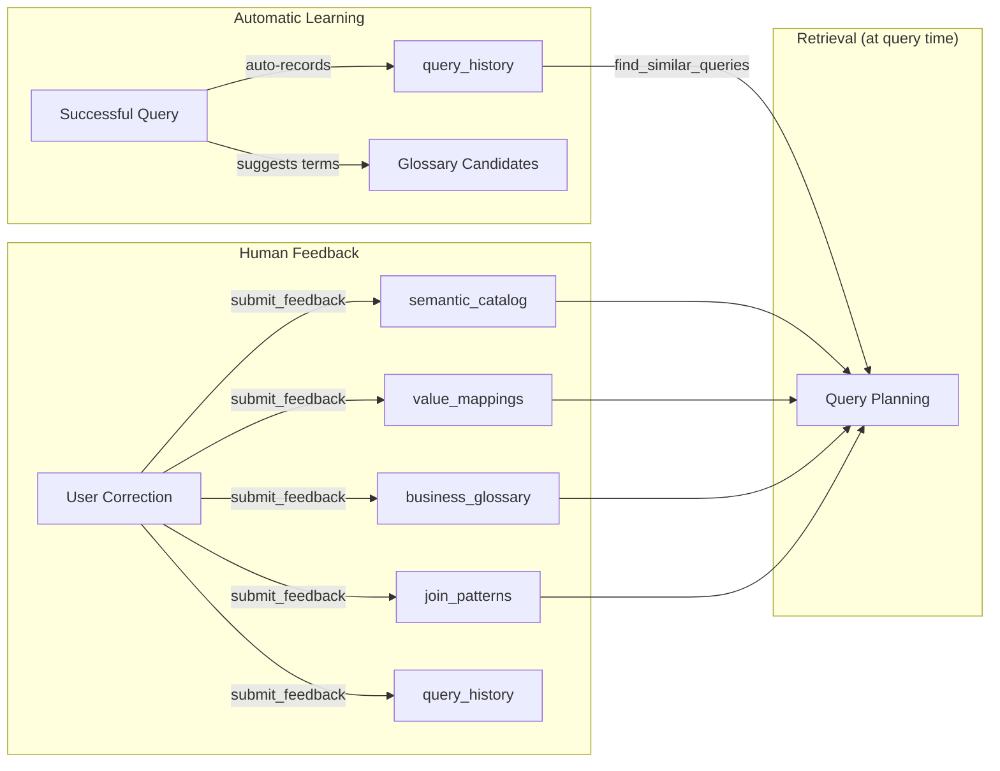

# Data Assistant — Intelligence Architecture Report

## Executive Summary

The Data Assistant builds a **persistent semantic knowledge graph** of BigQuery datasets through three interconnected systems: **structural profiling** (automated data analysis), **LLM semantic enrichment** (AI-generated descriptions and join inference), and **continuous learning** (human feedback + query history). Each layer progressively deepens the system's understanding, resulting in increasingly accurate SQL generation over time.



---

## 1. Dataset Profiling — How Tables Are Analyzed

### Trigger Points

Profiling is triggered in three ways:

| Trigger | Function | Behavior |
|---|---|---|
| **Automatic** | [`load_semantic_context()`](file:///home/user/dataassistant-main/dataagent/bq_tools.py#L2072-L2143) | If catalog is empty for a dataset, auto-triggers background profiling |
| **User-initiated** | [`start_background_profile()`](file:///home/user/dataassistant-main/dataagent/bq_tools.py#L1469-L1535) | When user says "profile this dataset" |
| **Force re-profile** | [`profile_dataset()`](file:///home/user/dataassistant-main/dataagent/bq_tools.py#L1691-L1824) | When user explicitly says "force re-profile" |

### Execution Model

Profiling runs **asynchronously** to avoid blocking the user:



- **In production (Cloud Run)**: Profiling runs as a separate **Cloud Run Job** via [`_submit_profiling_job()`](file:///home/user/dataassistant-main/dataagent/bq_tools.py#L1538-L1570)
- **In local dev**: Falls back to a **daemon thread** via [`_run_profiling_in_thread()`](file:///home/user/dataassistant-main/dataagent/bq_tools.py#L1573-L1608)
- **Status tracking**: The [`profiling_status`](file:///home/user/dataassistant-main/dataagent/semantic_catalog.py#L99-L108) table tracks `running`/`completed`/`failed` with stale detection (>30 min = failed)

### Phase 1: Structural Profiling (No LLM)

Implemented in [`profile_table()`](file:///home/user/dataassistant-main/dataagent/semantic_catalog.py#L271-L425) and orchestrated by [`run_phase1_structural()`](file:///home/user/dataassistant-main/dataagent/agents/bq_assistant/profile_job.py#L56-L110).

#### Step 1a: Schema Extraction

Queries `INFORMATION_SCHEMA.COLUMNS` for each table:

```sql
SELECT column_name, data_type, is_nullable, column_default,
       is_partitioning_column, clustering_ordinal_position
FROM `project.dataset.INFORMATION_SCHEMA.COLUMNS`
WHERE table_name = 'target_table'
ORDER BY ordinal_position
```

Falls back to `client.get_table()` API if INFORMATION_SCHEMA is unavailable.

#### Step 1b: Table-Level Statistics

For each table, retrieves via the BigQuery API:
- `num_rows` — total row count
- `num_bytes` — total table size

#### Step 1c: Column-Level Profiling

For tables **under 2 GB / 5M rows**, runs a single batched profiling query:

```sql
SELECT
  COUNTIF(`col1` IS NULL) AS null_col1,
  APPROX_COUNT_DISTINCT(`col1`) AS distinct_col1,
  COUNTIF(`col2` IS NULL) AS null_col2,
  APPROX_COUNT_DISTINCT(`col2`) AS distinct_col2,
  ...
FROM `project.dataset.table`
```

This produces per-column:
- **NULL percentage** — how sparse the column is
- **Distinct count** — cardinality (approximate)

For **large tables** (>2 GB or >5M rows), the system enters **schema-only mode** — column types and structure are captured but no data scanning is performed, avoiding timeouts.

#### Step 1d: Sample Value Collection

For each column on non-large tables:

```sql
SELECT `column_name` FROM `table` WHERE `column_name` IS NOT NULL LIMIT 5
```

Sample values are stored as JSON arrays in the catalog, enabling the LLM to reason about actual data content.

#### Step 1e: Semantic Type Inference (Heuristic)

Each column is classified by [`_infer_semantic_type()`](file:///home/user/dataassistant-main/dataagent/semantic_catalog.py#L428-L467) using rule-based heuristics:

| Semantic Type | Detection Rule | Confidence |
|---|---|---|
| `identifier` | Column name ends with `_id` or `_key` | 0.6 |
| `timestamp` | Data type is TIMESTAMP/DATE, or name contains `created_at`, `_on` | 0.6 |
| `metric` | Numeric type + name contains `amount`, `total`, `price`, `revenue` | 0.6 |
| `measure` | Numeric type (general) | 0.6 |
| `dimension` | String type + name contains `name`, `category`, `type`, `status` | 0.6 |
| `dimension` | String type + distinct count < 10% of total rows | 0.6 |
| `attribute` | String type (general, e.g. `url`, `email`) | 0.6 |
| `flag` | Boolean type | 0.6 |
| `unknown` | No match | 0.3 |

> [!NOTE]
> These heuristic confidence scores start at 0.6 and are refined upward by LLM analysis (Phase 2) or to 1.0 by human feedback (Phase 3).

#### Step 1f: Join Discovery — Level 1 (Name Matching)

[`discover_joins()`](file:///home/user/dataassistant-main/dataagent/semantic_catalog.py#L934-L1010) finds join relationships by matching columns with the **same name and data type** across tables:

```
Table A has: user_id (INT64)
Table B has: user_id (INT64)
→ Discovery: A.user_id ↔ B.user_id (exact_name, confidence=0.7)
```

Common non-join columns (`created_at`, `updated_at`, `description`, `name`) are excluded from matching.

Each discovery is deduplicated against existing patterns before persisting.

---

## 2. LLM Semantic Analysis — AI-Powered Understanding

Implemented in [`llm_describer.py`](file:///home/user/dataassistant-main/dataagent/llm_describer.py) and orchestrated by [`run_phase2_semantic()`](file:///home/user/dataassistant-main/dataagent/agents/bq_assistant/profile_job.py#L113-L194).

All LLM calls use **Gemini** (`gemini-3-flash-preview`) via Vertex AI with low temperature (0.3) for factual accuracy.

### Phase 2a: Table Descriptions

[`generate_table_descriptions()`](file:///home/user/dataassistant-main/dataagent/llm_describer.py#L90-L118) sends table profiles (schema, statistics, sample values, known joins) to Gemini and asks for:

1. **Description** — 1-2 sentence natural language explanation of the table's purpose
2. **Concepts** — 3-5 key business concepts represented
3. **Use Cases** — 2-3 suggested analytics use cases

Tables are **batched** (up to 5 per LLM call) for efficiency. The prompt includes column statistics, cardinality, NULL rates, and sample values so the LLM can reason about actual content.

**Example LLM output:**
```
TABLE: users
DESCRIPTION: Core user account table containing registered user profiles with creation and last-active timestamps.
CONCEPTS: user identity, account lifecycle, registration, authentication
USE_CASES: user growth analysis, churn analysis by signup cohort, user segmentation
```

### Phase 2b: Intelligent Join Inference — Level 2 (LLM)

[`infer_joins()`](file:///home/user/dataassistant-main/dataagent/llm_describer.py#L200-L260) goes beyond name-matching to discover semantic relationships:

The prompt provides:
- All tables with their column names, types, and semantic types
- All Level 1 heuristic joins (for the LLM to confirm or reject)

The LLM is asked to:
1. **Confirm or reject** each heuristic join
2. **Discover hidden joins** that name-matching missed, based on:
   - Column naming patterns (e.g., `owner_user_id` → `users.id`)
   - Semantic meaning (e.g., `answers` table → `questions` table)
   - Data type compatibility

**Example LLM discovery:**
```
JOIN: posts.owner_user_id ↔ users.id | confidence=0.9 | Foreign key pattern: owner_user_id references the users table
REJECT: posts.id ↔ comments.id | Both are primary keys, not a join relationship
```

New LLM-inferred joins are persisted with `discovered_by = "llm_inference"` and their own confidence scores.

### Phase 2b (continued): Relationship Map

[`generate_relationship_map()`](file:///home/user/dataassistant-main/dataagent/llm_describer.py#L334-L382) generates a **natural language explanation** of the data model:

- How tables relate to each other
- Recommended join paths for common analyses
- Caveats (e.g., tables that don't join directly)

This is written for a business analyst audience — plain language, specific column names, 2-4 paragraphs.

### Phase 2c: Dataset Summary

[`generate_dataset_summary()`](file:///home/user/dataassistant-main/dataagent/llm_describer.py#L385-L415) produces a one-paragraph overview:
- What domain the dataset covers
- Key entities
- Typical analytics use cases

### Storage

All Phase 2 outputs are persisted to BigQuery:
- Table descriptions → `dataset_analysis` table (tagged `[TABLE_DESCRIPTION]`)
- Relationship map → `dataset_analysis` table (tagged `[RELATIONSHIPS]`)
- Dataset summary → `dataset_analysis` table (tagged `[SUMMARY]`)
- LLM-inferred joins → `join_patterns` table

---

## 3. Continuous Learning — Getting Smarter Over Time

The Data Assistant improves through three feedback loops:



### 3a: Automatic Query Learning

Every successful query execution in [`execute_query()`](file:///home/user/dataassistant-main/dataagent/bq_tools.py#L591-L612) automatically records:

| Field | Source |
|---|---|
| `natural_language` | The user's original question |
| `sql` | The generated SQL that worked |
| `dataset` | Active dataset context |
| `tables_used` | Extracted from SQL (FROM/JOIN clauses) |
| `result_row_count` | Actual rows returned |
| `execution_time_ms` | Query timing |
| `was_successful` | Always `true` for auto-recorded |

This populates the [`query_history`](file:///home/user/dataassistant-main/dataagent/semantic_catalog.py#L75-L86) table.

**At query time**, [`find_similar_queries()`](file:///home/user/dataassistant-main/dataagent/semantic_catalog.py#L704-L757) uses **keyword-overlap scoring** to find relevant past queries. Each keyword match in the stored natural language adds to a relevance score. Stop words are filtered out.

The [`QueryPlannerAgent`](file:///home/user/dataassistant-main/dataagent/agents/bq_assistant/agent.py#L63-L149) always calls this in **Step 2** of its pipeline before writing new SQL, allowing it to adapt proven patterns.

### 3b: Glossary Suggestion Engine

After every successful query, [`suggest_glossary_entries()`](file:///home/user/dataassistant-main/dataagent/semantic_catalog.py#L1128-L1185) automatically extracts candidate business terms:

1. Generates 2-word and 3-word n-grams from the user's natural language question
2. Filters out noise phrases ("show me", "how many", "top most")
3. Filters out existing glossary terms
4. Requires at least one meaningful (non-stop) word
5. Returns up to 3 candidates

The agent presents these to the user: *"I noticed some terms that might be worth recording in the business glossary: **active users**, **north star metric**. Would you like to define what any of these mean?"*

### 3c: Human Feedback — Five Types

[`submit_feedback()`](file:///home/user/dataassistant-main/dataagent/bq_tools.py#L1954-L2033) is the primary tool for human knowledge capture. All feedback is stored with `confidence = 1.0` (highest priority in the knowledge graph).

#### Type 1: Column Rename (`column_rename`)

**Trigger**: User says *"revenue means the gross_total column"*

**Effect**: Updates the `semantic_catalog` table — sets `business_name`, `description`, `discovered_by = 'human_feedback'`, `confidence = 1.0`.

```sql
UPDATE `semantic_catalog` SET business_name = 'Revenue', 
  description = 'Total gross revenue', discovered_by = 'human_feedback', 
  confidence = 1.0 WHERE table_name = 'sales' AND column_name = 'gross_total'
```

#### Type 2: Value Mapping (`value_mapping`)

**Trigger**: User says *"status 4 means 'Churned'"*

**Effect**: Inserts into [`value_mappings`](file:///home/user/dataassistant-main/dataagent/semantic_catalog.py#L88-L97) table. Future queries see: `status = '4' → "Churned"` in their semantic context, so the LLM knows to use `WHERE status = 4` when the user says "churned customers".

#### Type 3: Business Glossary (`glossary`)

**Trigger**: User says *"North Star Metric = active_users / total_users * 100"*

**Effect**: Upserts into [`business_glossary`](file:///home/user/dataassistant-main/dataagent/semantic_catalog.py#L63-L73) table with the SQL expression. The agent uses this to translate business language to SQL in future queries.

#### Type 4: Join Pattern (`join_pattern`)

**Trigger**: User says *"orders and customers are joined on customer_id"*

**Effect**: Inserts into `join_patterns` with `join_type = 'human_defined'`, `confidence = 1.0`. Human-defined joins are prioritized over heuristic (0.7) and LLM-inferred (0.8) joins.

#### Type 5: Query Correction (`query_correction`)

**Trigger**: User corrects the agent's SQL

**Effect**: Records the corrected SQL in `query_history` with `user_feedback = 'corrected'` and `feedback_notes` explaining what was wrong. Future similar queries will find the corrected version.

### 3d: How Learning Is Used at Query Time

The [`QueryPlannerAgent`](file:///home/user/dataassistant-main/dataagent/agents/bq_assistant/agent.py#L63-L149) follows a mandatory 5-step pipeline:

```
Step 1: load_semantic_context()
  ├── Column catalog (types, semantics, sample values, NULL%)
  ├── Known join patterns (heuristic + LLM + human)
  ├── Business glossary (term → SQL mappings)
  ├── Value mappings (coded value → meaning)
  └── Ambiguous columns (low confidence, ask user)

Step 2: get_query_suggestions()
  └── Similar past queries (NL, SQL, row count, user feedback)

Step 3: probe_column() [if needed, max 5]
  └── Actual column values before writing SQL

Step 4: dry_run()
  └── Validate syntax + estimate cost

Step 5: execute_query()
  └── Auto-records to query_history for future learning
```

### 3e: Confidence Hierarchy

Knowledge sources are prioritized by confidence:

| Source | Confidence | Priority |
|---|---|---|
| Human feedback | **1.0** | Highest — always trusted |
| LLM inference | **0.8** | High — semantic reasoning |
| Heuristic (name match) | **0.7** | Medium — statistical pattern |
| Auto-profile (full data) | **0.6** | Medium — data-driven inference |
| Auto-profile (schema only) | **0.2–0.4** | Low — structure only, no data |
| Unknown | **0.3** | Low — flagged as ambiguous |

Ambiguous columns (confidence < 0.5 or `semantic_type = 'unknown'`) are surfaced in a special `⚠️ Ambiguous Columns` section when loading semantic context. The QueryPlannerAgent is instructed to **ask the user** before using these columns in queries.

---

## Semantic Catalog — The Persistent Brain

All knowledge is stored across 6 BigQuery tables in the user's workspace dataset:

| Table | Contents | Row Example |
|---|---|---|
| [`semantic_catalog`](file:///home/user/dataassistant-main/dataagent/semantic_catalog.py#L30-L47) | Column-level metadata | `posts.owner_user_id, INT64, identifier, confidence=1.0, discovered_by=human_feedback` |
| [`join_patterns`](file:///home/user/dataassistant-main/dataagent/semantic_catalog.py#L49-L61) | Join relationships | `posts.owner_user_id ↔ users.id, llm_inferred, confidence=0.9` |
| [`business_glossary`](file:///home/user/dataassistant-main/dataagent/semantic_catalog.py#L63-L73) | Business term → SQL | `"revenue" = SUM(gross_total), confidence=1.0` |
| [`query_history`](file:///home/user/dataassistant-main/dataagent/semantic_catalog.py#L75-L86) | Successful NL→SQL pairs | `"top 10 stations" → SELECT ... LIMIT 10, 10 rows` |
| [`value_mappings`](file:///home/user/dataassistant-main/dataagent/semantic_catalog.py#L88-L97) | Encoded value meanings | `orders.status = '4' → "Churned"` |
| [`profiling_status`](file:///home/user/dataassistant-main/dataagent/semantic_catalog.py#L99-L108) | Background job state | `stackoverflow, completed, 2026-04-17T10:00:00Z` |

### Self-Healing Properties

- **Stale detection**: If a profiling job shows `running` for >30 minutes, it's automatically treated as `failed`
- **Auto-re-trigger**: If `load_semantic_context` finds an empty catalog despite `completed` status, it re-triggers profiling
- **Duplicate protection**: Both `profile_dataset` and `start_background_profile` check status before starting
- **Legacy migration**: Old `dataset_analysis` text blobs are migrated into the structured catalog on first profile

---

## Source File Reference

| File | Role |
|---|---|
| [bq_tools.py](file:///home/user/dataassistant-main/dataagent/bq_tools.py) | All agent-facing tools (25+ functions) |
| [semantic_catalog.py](file:///home/user/dataassistant-main/dataagent/semantic_catalog.py) | Persistent knowledge graph (catalog CRUD, join discovery, feedback processing) |
| [llm_describer.py](file:///home/user/dataassistant-main/dataagent/llm_describer.py) | LLM-based semantic analysis (descriptions, joins, relationship maps) |
| [query_planner.py](file:///home/user/dataassistant-main/dataagent/query_planner.py) | Query validation, diagnostics, confidence scoring |
| [profile_job.py](file:///home/user/dataassistant-main/dataagent/agents/bq_assistant/profile_job.py) | Background profiling job (Phase 1 + Phase 2 orchestration) |
| [agent.py](file:///home/user/dataassistant-main/dataagent/agents/bq_assistant/agent.py) | Agent definitions, system prompts, tool registration |
